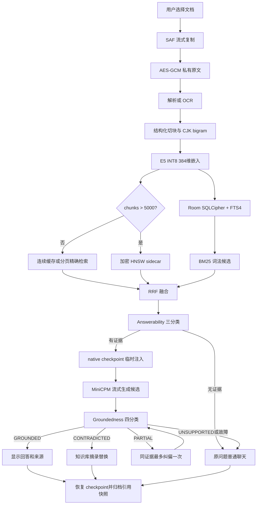

# MiniCPM-V Android 正式版完整改造报告

## 1. 报告信息

| 项目 | 内容 |
|---|---|
| 报告日期 | 2026-08-28 |
| 上游项目 | OpenBMB/MiniCPM-V-Apps |
| 上游基线 | Android Demo 2.3，提交 `2b4049fd877be538e77cae5122204ee0ea3ac34c` |
| 当前正式分支 | `main` |
| 功能与模型基线提交 | `43f88eb08574455562ee8424f68a2c89b39547a8` |
| 公开仓库 | `https://github.com/Si1as-code/MiniCPM-V-Android-Modified` |
| 目标平台 | Android，arm64-v8a |
| 主要真机 | vivo V2359A，Android 16 / API 36 |
| 改造范围 | Android 应用、端侧 RAG、RAG Guard、训练/评测工具、构建与发布工程 |

本报告以 Git 历史、当前源码、架构决策、威胁模型、历史实施计划、训练记录、模型 manifest、量化记录以及真机验收文档为交叉证据。Git 基线到正式版共有 **37 个增量提交、439 个变更文件、203,891 行新增、402 行删除**。iOS、HarmonyOS 和共享 `llama.cpp-omni` 的上游主体不属于本轮功能改造范围。

## 2. 执行摘要

最初版本是一个以 MiniCPM-V/llama.cpp-omni 为推理核心的 Android 演示应用，主要完成模型下载、文本/图片对话和基础设置。正式版在不把用户文档上传云端、不引入第二套生成模型运行时的前提下，完成了以下升级：

1. 将演示型单会话界面升级为支持状态栏避让、拍照、图片预处理、原图查看、多会话永久保存、消息编辑/删除/回滚和稳定键盘交互的完整聊天应用。
2. 增加无图视觉幻觉保护与离线内容安全策略，所有本地固定提示均与模型上下文隔离。
3. 建立端侧知识库：手机本地导入、加密保存、解析/OCR、结构化切块、E5 向量化、FTS4 BM25、dense 检索、RRF 融合、HNSW 大库索引、引用归档和来源查看。
4. 使用 native checkpoint 把知识库证据限制在单轮推理事务中，失败、取消、切后台或输出审查失败时恢复稳定上下文。
5. 训练并部署 RAG Guard v4.2：Answerability 三分类与 Groundedness 四分类，共享 multilingual-E5 编码器；模型完成 INT8 ONNX 导出、Git LFS 发布、APK 打包、私有目录原子安装和真机双头推理验收。
6. 建立可恢复导入、原子索引发布、固定签名覆盖安装、性能/压力/force-stop 测试和 Graphify 持久知识图谱。

正式版的核心产品语义是：**选择 READY 知识库后所有问题都先检索；有可靠证据才增强回答；没有证据或技术故障时保持普通聊天；明确与知识库冲突时优先采用知识库证据。**

## 3. 初始版本与正式版本边界

### 3.1 上游初始能力

基线提交提供 MiniCPM-V 系列 GGUF 模型的端侧加载与推理、文本和图片对话、模型管理与下载、JNI/`llama.cpp-omni` 本地推理链以及 Android XML/Kotlin 演示界面。

基线没有完整实现多会话永久历史、可编辑时间线、图片预输入缓存和原图生命周期、输入/输出安全审查、本地知识库与引用、大规模向量索引、RAG 输出依据性分类器、统一固定签名和真机发布矩阵。

### 3.2 当前代码规模与工具链

当前 Android 主源码中，RAG 子系统包含 111 个 Kotlin/Java 主文件；JVM 测试文件 83 个、Android instrumentation 测试文件 32 个、RAG Guard Python 测试文件 26 个。数据库 schema 已演进到 Room `version = 3`。

当前代码而非旧文档决定实际构建版本：

| 组件 | 当前值 |
|---|---:|
| JDK | 21 |
| Gradle | 9.6.1 |
| Android Gradle Plugin | 9.3.0 |
| compileSdk / targetSdk | 37 / 37 |
| minSdk | 24 |
| NDK | 29.0.14206865 |
| CMake | 4.1.2 |
| Room / WorkManager | 2.8.4 / 2.11.2 |
| SQLCipher Android | 4.17.0 |
| ONNX Runtime / Extensions | 1.25.0 / 0.13.0 |
| hnswlib | 0.9.0 |

## 4. 改造时间线

### 4.1 图片、系统界面与设置（2026-08-03）

对应提交：`bb4aaa7`、`e79c2bf`、`392a433`、`3a31577`。

- 取消沉浸式全屏，主界面、模型管理、TTS 和原图查看页永久保留系统状态栏，并使用 Insets 避让顶部区域。
- 在聊天输入栏增加拍照按钮，通过系统相机和未导出的 `FileProvider` 生成受控临时文件，不直接申请相机权限。
- 相册或相机图片先复制到私有缓存再显示，解决部分 vivo 内容 URI 只能读取一次导致的“无法读取图片”。
- 图片预处理期间使用暗化缩略图、不确定进度圆环和等待文案；完成后隐藏圆环，不伪造 `100%`。
- 读取 EXIF 1–8 方向，生成最大边 512 px 的 UI 预览，并限制模型位图尺寸和像素数。
- 预输入区和已发送气泡均可打开私有缓存原图；UI 只持有不透明令牌，不传递任意文件路径。
- 预处理中的图片可立即删除；界面先隐藏，后台再取消并等待 native 任务退出。
- 模型下载期间应用前后台切换不再重复弹出“模型未下载”。
- 左上角统一设置入口整合模型管理、图片切片数、会话管理和清空会话；危险操作保持二次确认。

### 4.2 视觉幻觉与内容安全（2026-08-04 至 2026-08-05）

对应提交：`9b4aa0a`、`eadcaba`。

#### 无图视觉保护

- 引入会话级 `hasVisualContext`：只有图片/视频成功写入 native 上下文后才为真；新会话、清空、切换/卸载模型时重置。
- 输入视觉意图三分类：`NEED_VISUAL`、`TEXT_ONLY`、`UNCERTAIN`。
- 输出视觉断言三分类：`VISUAL_ASSERTION`、`NON_VISUAL_RESPONSE`、`UNCERTAIN_VISUAL_ASSERTION`。
- 无图时明确依赖图片的输入不调用模型；生成的视觉断言在显示前丢弃。
- 被拦截输入和本地提示使用助手气泡模拟流式输出，但 `includeInModelContext=false`。
- 绕过语句保存在 `app/src/test/resources/visual_guard_regression_cases.tsv`，形成持续回归集。

#### 本地内容安全

- 完全离线检测手机号、身份证号、结构化地址和部分高风险操作性请求。
- 策略统一为 `ALLOW`、`WARNING`、`BLOCK`、`REVIEW`。
- 输入隐私不立即提交：用户消息下方显示“否，删除”和“是，继续发送”，只有明确选择“是”才调用模型。
- 模型输出先在内存中缓冲，再经过视觉与内容双重审查；违法或待复核原文不显示。
- 固定安全提示在应用层流式显示，不进入模型上下文。
- 当前安全分类器是可审计的确定性基线，不等于覆盖全部违法语义的训练型审核模型。

### 4.3 多会话、永久保存与编辑（2026-08-07）

对应提交：`1bd7802`，并由后续提交继续修正。

- 新建 `ConversationStore`、版本化 archive codec 和原子磁盘存储。
- 支持创建、切换、删除多个会话，按首条用户消息生成标题。
- 会话保存文字、视觉上下文、消息 ID、原图令牌和缩略图；损坏主文件尝试上一份有效备份。
- 会话文本与图片排除 Android 自动备份和设备迁移。
- 编辑用户消息后从该处截断后续历史并重新回答；编辑 AI 消息只修改显示文本和后续上下文。
- 用户与 AI 消息均可单独删除；含图历史通过私有令牌重新预填充。
- 编辑/删除/切换会话前 cancel-and-join 当前任务，再重置 native 上下文并回放允许进入上下文的消息。
- AI 长按区域扩大到整个气泡及子视图。

### 4.4 端侧 RAG 数据与导入基础（2026-08-11 至 2026-08-13）

对应提交：`c26e422`、`18976a5`、`8e367e2`、`dce104f`、`f1c48e8`、`d62ab3e`、`2c5b654`、`6d7f48b`。

#### 知识库和数据库

- 创建知识库时必须命名；会话可独立启用 RAG并绑定知识库。
- Room/SQLCipher 保存知识库、文档、chunk、embedding、FTS4、会话绑定和引用快照。
- 数据库随机口令由 Android Keystore 包装；原始文档使用 AES-GCM 私有容器。
- 知识库/文档删除执行级联清理；删除知识库需要二次确认。

#### 导入流水线

- 使用 SAF 多文档选择，不依赖原始文件路径。
- WorkManager 分阶段执行 `COPYING -> PARSING/OCR -> CHUNKING -> EMBEDDING -> INDEXING -> READY`。
- 每阶段可恢复、可取消、幂等；失败仅保存匿名错误码，不泄露 URI、正文或私有路径。
- 未成功导入的文件不保留正式文档记录；失败提示可左滑移除，同名文件可再次上传。
- READY 文档支持长按删除，UI 按真实阶段显示文案，不使用虚假百分比。

#### 文档解析与限额

- 支持 TXT、Markdown、CSV、HTML、PDF、OCR、DOCX、PPTX、XLSX。
- 通过魔数和结构识别文件类型，修复“扩展名为 txt 却被误判不支持”的问题。
- 关键上限：单源文件 100 MiB、知识库私有文件合计 2 GiB、PDF 1,000 页、OOXML 20,000 条目、解压后 500 MiB、压缩比 100、XML 深度 128、每文档 2,000 万字符、解析最长 15 分钟。
- OOXML 禁止宏、外部实体、脚本和网络资源；路径规范化后必须仍位于受控目录。
- 文本解析保持源文件换行语义。

### 4.5 嵌入、混合检索与上下文事务（2026-08-14 至 2026-08-19）

对应提交：`64f0d7f`、`aae905e`、`aed6406`、`91362c0`、`ebab5c2`、`e7ce7a8`、`cb3d5d7`、`9ec639c`、`443df24`、`1f0b016`、`b2a79c2`。

#### 切块与嵌入

- 解析器输出结构化 block；切块保留标题、段落、列表、表格行和定位信息。
- 中文检索文本加入 CJK bigram，英文保留词项和短语。
- `multilingual-e5-small` INT8 ONNX 输出 384 维向量；查询使用 `query: `，文档使用 `passage: `。
- tokenizer、模型大小和 SHA-256 固定；首次检索时懒加载。
- 真机比较 CPU、NNAPI 与 NNAPI FP16 后选择 CPU：2 线程 P95 `4.17 ms`。

#### 混合检索

- 词法路使用 FTS4 `matchinfo`，由 Kotlin 安全解析并计算 BM25；查询词经过转义和绑定。
- 语义路使用归一化 E5 向量的余弦相似度。
- 两路按 RRF 融合，默认 `rankConstant=60`、最多 12 个候选：

$$
\operatorname{RRF}(d)=\sum_{r\in\{\text{dense},\text{lexical}\}}
\frac{1}{60+\operatorname{rank}_{r}(d)}.
$$

- 最终排序为 RRF、dense、BM25 降序，再以 chunk ID 升序稳定打破并列。
- 早期绝对 BM25 阈值在 40 文档合成集有效，却在单文档知识库失败；根因是

$$
\operatorname{IDF}(t)=\log\frac{N-df_t+\delta}{df_t+\delta}
$$

随语料规模变化。绝对 BM25 门槛被废弃，改为精确锚点、低信号拒绝和本地 Answerability 级联。

#### 临时证据事务

- native 层新增上下文 checkpoint 保存/恢复接口。
- RAG 证据只在当前生成事务临时追加；完成、取消、异常、切后台或编辑后恢复稳定上下文。
- 被拒绝候选、纠偏提示和本地安全提示不写入稳定历史。
- `RagCoordinator` 统一 `Disabled/NoSelection/Indexing/NoEvidence/Ready/Failed` 决策。
- 最终采用 `ALL_QUERIES`：启用且选择 READY 知识库后所有问题都检索；早期 Adaptive 路由只保留为历史实验。
- 有证据时按真实 MiniCPM tokenizer 限制 prompt；无证据或技术失败时使用未经修改的原文普通生成。

### 4.6 来源生命周期、阶段 UI 和大库 HNSW（2026-08-20 至 2026-08-21）

对应提交：`9b229c2`、`3614b3d`、`2ea6be2`、`43286fd`、`1665a71`、`8983041`、`c7c6d25`。

- RAG 回答保存 `ragRunId`、来源编号和不可变引用快照；源文档删除后仍显示归档快照状态。
- `RETRIEVING/ORGANIZING/GENERATING` 是内存临时 UI 状态，不写入会话 archive。
- 规划和 Groundedness 阶段有 15 秒 watchdog；普通生成不受此上限。
- 小于等于 5,000 chunks 使用连续缓存；缓存无效时以 1,000 行分页精确检索。
- 大于 5,000 chunks 使用 hnswlib 0.9.0；参数 `M=16`、`efConstruction=100`、`efSearch=256`。
- 元数据记录版本、384 维、模型 SHA、知识库集合、语料 generation、数量、长度和摘要。
- HNSW payload 和 metadata 均认证加密；同目录临时文件、`fsync`、校验和原子替换，保留上一代认证索引。
- 缺失、过期、损坏、过大或内存准入失败时，本次请求分页精确降级，并唯一调度后台重建。
- 打开前估算 RSS，超过应用内存预算 10% 时拒绝 sidecar。
- 四个真实 force-stop 窗口均恢复到唯一认证 generation，且无 `.new/.bak` 或明文残留。

真机 20k 向量结果：Recall@10 `0.9833`，生产 HNSW P50/P95 `206.61/216.16 ms`，加密索引 `33,693,766` bytes，构建 `4.87 s`，native handle 最终为 0。

### 4.7 发布验证与键盘交互（2026-08-24）

对应提交：`d67a218`、`244cded`。

- 完成 0/10/30 轮历史的普通与 RAG 首 token 性能矩阵；RAG 30 轮 P95 为 `2.360 s`。
- 完成固定签名 `adb install -r` 覆盖安装，验证会话、知识库、文档、模型和 HNSW 聚合指纹不变。
- 完成图片、旋转、Home/前台、pause/resume、编辑和会话切换人工验收。
- 键盘展开前记录最后可见消息和像素偏移，展开后恢复同一视觉锚点。
- 键盘打开时聊天可滚动，滑动/长按不收键盘，点击对话区才收起。
- 最新消息与输入栏仅保留 12dp，不重复预留输入栏高度。

### 4.8 RAG Guard v4.2 训练、量化与正式接入（2026-08-24 至 2026-08-28）

对应提交：`deafcfd`、`43f88eb`。

#### 标签与动作

| 任务 | 标签 | 动作语义 |
|---|---|---|
| Answerability | `SUPPORTED/PARTIAL/UNSUPPORTED` | 判断检索证据是否足以进入生成 |
| Groundedness | `GROUNDED` | 接受候选 |
| Groundedness | `PARTIAL` | 同证据最多重生成一次，仍失败则知识库摘录替换 |
| Groundedness | `UNSUPPORTED` | 恢复 checkpoint，使用原问题普通生成 |
| Groundedness | `CONTRADICTED` | 不显示模型草稿，直接知识库摘录替换 |

#### 数据集演进

- v2：规则化合成数据，只验证流水线。
- v3：中英文多来源语料，暴露 Groundedness 对金额和日期的高置信误判。
- v4/v4.1：改为 3+4 类；修复候选答案右截断、HoVer 二合一负标签误映射、固定元答案捷径和困难切片缺失。
- v4.2：关系反例限定为同证据同粗粒度类型；日期与金额/单位分离；固定 tokenizer 构造 256-token 可见窗口；中文负例使用自然跨文档问题。

正式 v4.2 共 270,000 行：Answerability 120,000、Groundedness 150,000；族级切分 train/calibration/test 为 `243,090/13,609/13,301`，跨 document、conversation、mutation、translation 和 near-duplicate family 的交集为 0。

实际启用且许可批准的 v4 来源：ContractNLI、SQuAD 2.0、CMRC 2018、HoVer。FinQA 和 RAGTruth 因许可/第三方来源待复核未启用；带 NC 限制的 XNLI/OCNLI 不进入计划商用训练。

#### 训练、选模与制品

- 共享编码器：固定 revision 的 `intfloat/multilingual-e5-small`。
- 对照模型：固定 revision 的 `multilingual-MiniLMv2-L6-mnli-xnli`。
- 数据、seed、batch、学习率、token budget 和 5 epoch 保持一致。
- calibration-only 选择 E5：Answerability/Groundedness macro-F1 `0.907691/0.956991`；NLI 为 `0.890556/0.954531`。
- E5 `CONTRADICTED` precision/recall `0.951683/0.913497`。
- frozen test 在正式导出中保持未读。

| 制品指标 | 结果 |
|---|---:|
| FP32 ONNX | 470,310,373 bytes |
| INT8 ONNX | 118,171,779 bytes |
| INT8 SHA-256 | `d674ef4ef4fb2b4dce37d43c46eeb4b0e8038eb66da7cde1b568ca78dc45e1c2` |
| 压缩率 | 0.2512633907 |
| PyTorch/FP32 最大绝对差 | 0.0000088215 |
| INT8/FP32 标签一致率 | 0.9693585127 |
| 最大 calibration macro-F1 降幅 | 0.0107869130 |

产品最终删除量化性能阻断门槛，数值只作为观测记录；受控路径、大小、SHA-256、tokenizer、ONNX 契约、frozen-test 隔离和 APK 签名仍强制失败关闭。

模型通过 Git LFS 保存于 `models/rag-guard-v4-2-e5/model.int8.onnx`。Gradle 默认生成未压缩 APK asset；首次使用时复制到私有目录，执行临时文件、`fsync`、大小/哈希校验和原子替换。

vivo V2359A：模型打开 `1441.170 ms`，Answerability P50/P95 `8.245/8.475 ms`，Groundedness P50/P95 `10.505/11.755 ms`，30 次无标签漂移。

## 5. 正式版端到端架构



## 6. 安全、隐私与可靠性

- 数据库使用 SQLCipher，密钥由 Android Keystore 保护；原文和 HNSW payload 使用 AES-GCM。
- 文件使用随机 ID，路径规范化后必须仍位于受控目录；不以原始文件名拼路径。
- 文档内提示视为不可信引用材料，不得覆盖系统/用户指令；引用必须映射 READY 文档真实 chunk。
- 文档、数据库、索引、会话和图片排除云备份/迁移。
- 日志只记录随机 ID、阶段、耗时和错误码，不记录正文、问题、URI、密钥或完整路径。
- WorkManager 使用唯一任务和幂等状态机；索引保留上一代；会话编辑/模型切换先取消并等待任务。
- watchdog、checkpoint、force-stop 和覆盖安装均有自动化或真机证据。

## 7. 论文与研究来源映射

本节区分“直接影响正式实现”“用于训练标签/数据构造”“调研过但未进入正式实现”。网页、SDK 文档、模型卡和 NIST 指南不冒充论文；许可证仍以数据集官方条款为准。

### 7.1 直接影响正式实现

| 论文 | 对应修改 | 采用情况 |
|---|---|---|
| Lewis et al., 2020, [Retrieval-Augmented Generation](https://arxiv.org/abs/2005.11401) | 参数模型 + 外部知识、来源追溯 | 端侧检索与临时 prompt，不复刻端到端 RAG 训练 |
| Wang et al., 2022, [Text Embeddings by Weakly-Supervised Contrastive Pre-training](https://arxiv.org/abs/2212.03533) | E5 检索/分类编码器 | 采用 E5 模型族和 query/passage 前缀 |
| Wang et al., 2024, [Multilingual E5 Text Embeddings](https://arxiv.org/abs/2402.05672) | 中英文、多语种和小模型效率 | 使用 `multilingual-e5-small`，384 维 INT8 ONNX |
| Malkov & Yashunin, 2018, [HNSW](https://arxiv.org/abs/1603.09320) | 分层近邻图、大库 ANN | hnswlib 0.9.0，并增加加密发布和精确降级 |
| Robertson & Zaragoza, 2009, [BM25 and Beyond](https://doi.org/10.1561/1500000019) | FTS4 词法排序、IDF 规模敏感性 | Kotlin 解析 `matchinfo`；废弃跨规模绝对阈值 |
| Cormack, Clarke & Büttcher, 2009, [Reciprocal Rank Fusion](https://doi.org/10.1145/1571941.1572114) | dense/lexical 融合 | 采用 RRF，`rankConstant=60` |
| Xu, Shi & Choi, 2024, [RECOMP](https://proceedings.iclr.cc/paper_files/paper/2024/hash/bda88ed2892f5e61c9a9bf215c566913-Abstract-Conference.html) | 证据句子压缩、空增强 | 对应 sentence reducer；未采用生成式压缩器 |
| Park, Lee & Kim, 2025, [MobileRAG](https://arxiv.org/abs/2507.01079) | 部分加载索引、Selective Content Reduction | 影响分页后端、证据缩减、内存与真机基准 |

### 7.2 实验过但最终未保留

| 论文 | 实验 | 决定 |
|---|---|---|
| Jeong et al., 2024, [Adaptive-RAG](https://aclanthology.org/2024.naacl-long.389/) | no-retrieval/single-step/multi-step 路由 | 曾实现简单请求绕过；最终选择 `ALL_QUERIES` |

### 7.3 实际训练数据与标签构造论文

| 论文 | 作用 | v4.2 状态 |
|---|---|---|
| Koreeda & Manning, 2021, [ContractNLI](https://aclanthology.org/2021.findings-emnlp.164/) | 合同蕴含、矛盾、未提及、例外和 evidence span | 启用；条款已确认 |
| Rajpurkar, Jia & Liang, 2018, [SQuAD 2.0](https://arxiv.org/abs/1806.03822) | 可回答/对抗不可回答、最小对 | 启用 |
| Cui et al., 2019, [CMRC 2018](https://aclanthology.org/D19-1600/) | 中文 QA 和自然中文负例 | 启用 |
| Jiang et al., 2020, [HoVer](https://aclanthology.org/2020.findings-emnlp.309/) | 多跳、缺 hop、关系绑定 | 启用；二合一负标签不直接映射矛盾 |
| Williams et al., 2018, [MultiNLI](https://aclanthology.org/N18-1101/) | NLI 对照模型的英文背景 | 仅初始化背景 |
| Conneau et al., 2018, [XNLI](https://aclanthology.org/D18-1269/) | NLI 对照模型的跨语言背景 | 数据因 NC 限制不进入商用训练 |

### 7.4 调研过但未进入正式训练

| 论文 | 调研目的 | 状态 |
|---|---|---|
| Chen et al., 2021, [FinQA](https://arxiv.org/abs/2109.00122) | 金额、表格、数值推理 | 第三方源许可待复核，禁用 |
| Thorne et al., 2018, [FEVER](https://aclanthology.org/N18-1074/) | 事实验证与冲突标签 | 仅标签研究入口 |
| Aly et al., 2021, [FEVEROUS](https://arxiv.org/abs/2106.05707) | 文本+表格事实验证 | 未进入批准来源 |
| Niu et al., 2024, [RAGTruth](https://arxiv.org/abs/2401.00396) | RAG 词级幻觉检测 | 许可混合，禁用 |
| Li et al., 2023, [HaluEval](https://arxiv.org/abs/2305.11747) | 幻觉评测与对抗样本 | 仅调研 |
| Yi et al., 2023, [BIPIA](https://arxiv.org/abs/2312.14197) | 间接提示注入 | 影响威胁建模；数据未进入训练 |

## 8. 代码与证据追溯矩阵

下表给出正式功能的主要实现入口。它不是文件穷举，而是用于代码审查、上游合并和问题定位的最短追溯路径。

| 子系统 | 主要实现文件 | 主要测试/证据 |
|---|---|---|
| 状态栏与窗口避让 | `StatusBarVisibleActivity.kt`、`MainActivity.kt` | `StatusBarVisibilityInstrumentedTest`、人工 UI 验收 |
| 图片缓存与预处理 | `ImageSourceCache.kt`、`PendingImageViewModel.kt`、`PendingImageStateMachine.kt`、`ExifOrientationPolicy.kt`、`ImageDecodePolicy.kt` | 图片状态机/缓存/EXIF 单测、人工视觉闭环 |
| 相机与原图查看 | `MainActivity.kt`、`OriginalImageViewerActivity.kt`、`file_paths.xml` | `CameraCaptureInstrumentedTest`、原图路径边界测试 |
| 多会话与持久化 | `ConversationStore.kt`、`ConversationArchive.kt`、`StoredImageThumbnailLoader.kt` | `ConversationStoreTest`、archive codec/损坏恢复测试 |
| 消息编辑与回放 | `MessageTimelineActionPolicy.kt`、`ConversationStore.kt`、`LlamaEngine.kt`、`llama_jni.cpp` | 编辑、截断、AI 替换、上下文重建测试 |
| 视觉上下文保护 | `VisualContextPolicy.kt`、`LocalGuardReplyPolicy.kt`、`MainActivity.kt` | `visual_guard_regression_cases.tsv` 及数据驱动测试 |
| 本地内容安全 | `ContentSafetyPolicy.kt`、`ChatAdapter.kt`、`MainActivity.kt` | 隐私、违法、REVIEW、确认与绕过回归 |
| 知识库 UI | `KnowledgeBaseActivity.kt`、`KnowledgeBaseAdapter.kt`、`rag/ui/*` | 命名、选择、删除、失败左滑、同名重传测试 |
| 数据库与迁移 | `rag/db/RagDatabase.kt`、`RagEntities.kt`、`RagDaos.kt`、`RagMigrations.kt` | Room schema、迁移和 DAO instrumentation |
| 加密 | `RagKeyManager.kt`、`EncryptedFileStore.kt`、`RagDatabaseFactory.kt` | `RagEncryptionTest`、错误密钥/篡改拒绝测试 |
| 导入与恢复 | `rag/importer/*`、`rag/work/*` | WorkManager 状态机、取消、重启恢复和匿名失败测试 |
| 文档解析 | `rag/parser/*`、`RagLimits.kt` | TXT/Markdown/CSV/HTML/PDF/OCR/OOXML 限额与恶意输入测试 |
| 结构化切块 | `DocumentChunker.kt`、`ChunkIdentity.kt`、`CjkBigramEncoder.kt` | 切块边界、稳定 ID、中文检索文本测试 |
| E5 嵌入 | `E5Embedder.kt`、`E5Tokenizer.kt`、`EmbeddingModelManager.kt` | E5 tokenizer/池化/模型包测试及 provider benchmark |
| FTS4/BM25 | `RoomLexicalEvidenceRetriever.kt`、`FtsMatchInfo.kt` | 手算 BM25、FTS 注入和跨规模纠正证据 |
| dense/RRF | `RoomDenseEvidenceRetriever.kt`、`ExactVectorRanker.kt`、`ReciprocalRankFusion.kt`、`HybridRetriever.kt` | exact oracle、排序稳定性和混合检索真机测试 |
| HNSW | `HnswIndex*.kt`、`HnswVectorSearchBackend.kt`、`rag_hnsw_jni.cpp`、vendored hnswlib | 1k/5k/20k benchmark、publication、force-stop、handle 泄漏测试 |
| RAG 编排 | `RagCoordinator.kt`、`RagTurnDeliveryPolicy.kt`、`RagTurnTransaction.kt` | ALL_QUERIES 三路径、生命周期、checkpoint 压力测试 |
| Prompt 与引用 | `RagContextBudgeter.kt`、`RagPromptAssembler.kt`、`CitationValidator.kt`、`CitationSourceResolver.kt` | token 对齐、XML 边界、伪引用和来源生命周期测试 |
| Answerability | `CascadedEvidenceAcceptancePolicy.kt`、`LazyAnswerabilityClassifier.kt`、`OnnxRagGuardClassifier.kt` | 3 类契约、阈值/SHA/候选上限测试 |
| Groundedness | `RagReviewedGenerator.kt`、`RagOutputReviewPolicy.kt`、`OnnxRagGuardClassifier.kt` | 4 类动作、一次纠偏、知识库替换、技术故障回退测试 |
| Guard 模型安装 | `RagGuardBundledModelInstaller.kt`、`RagGuardModelManager.kt`、`RagGuardModelManifest.kt` | 原子安装、损坏替换、路径/大小/SHA 和真机双头测试 |
| 训练数据与模型 | `tools/rag_guard/build_*_v4.py`、`train.py`、`export_onnx.py`、`mutations/*` | 26 个 Python 测试文件、dataset audit、checkpoint audit、量化 manifest |
| 构建与签名 | `app/build.gradle.kts`、`gradle/libs.versions.toml`、wrapper、`scripts/run-device-instrumentation.ps1` | `verifyInstallationSigning`、APK 条目/签名和覆盖安装证据 |
| 项目知识图谱 | `graphify-out/graph.json`、`graph.html`、`GRAPH_REPORT.md` | 每次本地代码/文档修改后的 `graphify update` 与 query |

### 8.1 关键证据文件

- 架构基线：`docs/architecture/ADR-001-local-rag-stack.md`；
- 安全边界：`docs/architecture/rag-threat-model.md`；
- 唯一统一进度：`docs/superpowers/plans/2026-08-18-minicpm-android-unified-progress-plan.md`；
- 训练全记录：`tools/rag_guard/TRAINING_RUN_V4.md`；
- 数据集卡：`tools/rag_guard/DATASET_CARD_V4.md`；
- 正式模型：`models/rag-guard-v4-2-e5/manifest.json` 与 `quantization_metrics.json`；
- 真机性能：`docs/execution/evidence/e5-execution-provider-benchmark-20260821.md`、`hnsw-scale-benchmark-20260821.md`、`rag-end-to-end-performance-20260824.md`；
- 恢复与持久性：`hnsw-force-stop-recovery-20260824.md`、`installation-persistence-20260824.md`；
- 人工验收：`manual-ui-lifecycle-acceptance-20260824.md`。

## 9. 测试与验收证据

| 类别 | 结果 |
|---|---|
| JVM 回归 | 文档记录 308/308 通过 |
| RAG Guard Python | 143 passed，9 subtests passed |
| Debug APK | 构建通过；模型未压缩打包 |
| 签名 | APK Signature Scheme v2；固定证书 SHA-256 `12befeda...eb85` |
| 图片与生命周期 | vivo V2359A 人工矩阵通过 |
| 覆盖安装 | 会话、消息、知识库、文档、E5、Guard、HNSW 指纹一致 |
| E5 真机 | CPU 2 threads P95 `4.17 ms` |
| HNSW 20k | Recall@10 `0.9833`，P95 `216.16 ms` |
| RAG TTFT | 30 轮 RAG P95 `2.360 s` |
| Guard v4.2 | Answerability P95 `8.475 ms`，Groundedness P95 `11.755 ms`，30 次稳定 |
| force-stop | 4 个发布窗口全部恢复且无明文/临时残留 |

## 10. 关键问题、根因与修复

| 问题 | 根因 | 修复 |
|---|---|---|
| vivo 图片无法读取 | 内容 URI 是一次性安全流 | 首次选择即复制到私有缓存 |
| 下载模型重复弹窗 | 前后台恢复未识别活动下载服务 | 增加下载任务状态策略 |
| 无图编造图片 | 生成模型没有可靠视觉状态 | 输入/输出双三分类 + 状态机 |
| 本地提示污染聊天 | UI 消息和模型历史未区分 | `includeInModelContext=false` |
| TXT 偶发不支持 | 扩展名/探测与单次 URI 不一致 | 私有复制、魔数/文本探测、换行保真 |
| 简单问候长期卡住 | 预填、长历史和阶段等待叠加 | checkpoint、token 预算、懒加载、watchdog、缩减 |
| BM25 跨库失效 | IDF 依赖语料规模 | 废弃绝对阈值，级联 Answerability |
| 大库精确检索慢 | 全向量线性扫描 | 5k 分界、HNSW、分页精确回退 |
| HNSW 中断残留 | AtomicFile 中断残留 | 认证恢复后精确清理 `.new/.bak` |
| v4.1 训练震荡 | 候选截断、误映射、模板捷径 | 保护句对、可见窗口、关系最小对、族级切分 |
| 覆盖安装测试误报 | 把 v3→v4.2 迁移当成哈希不变 | 用户数据不变，Guard 必须迁移到固定哈希 |

## 11. 正式版限制与未夸大事项

1. “正式版”表示代码、制品、构建、签名、安装和端侧流程完成，不表示所有领域回答绝对正确。
2. v4.2 frozen test 未在正式导出中打开；量化质量只以 calibration 记录。
3. 量化标签一致率 `0.96936` 和 macro-F1 降幅 `0.01079` 没有包装成“通过门槛”；性能门槛已删除。
4. 旧 v3 金额/日期失败矩阵不能解释为 v4.2 结果。
5. 真实办公脱敏集仍应继续评测，但当前是非阻断质量观测。
6. 规则型视觉/内容安全分类器不等同于完整语义审核模型。
7. root、系统漏洞、屏幕录制、无障碍服务和主动导出不在可完全防御范围内。

## 12. 文档一致性审计

报告以当前代码为最高优先级，发现以下文档漂移：

- `README_MODIFIED_zh.md` 环境段仍写 compileSdk 36、NDK 27；当前代码为 SDK 37、NDK 29。
- README 标题仍为“本地 RAG（开发中）”，正文和统一进度已声明正式工程闭环。
- `tools/rag_guard/data/dataset_sources.json` 的 v4 状态仍写 `pre_training_preparation`，更适合作为历史来源登记。
- `groundedness-release-matrix-20260824.md` 是 v3 历史失败矩阵，必须和 v4.2 真机稳定性分开引用。

## 13. 已审阅文档范围

- 上游与总览：根 README 中英文版、DOWNLOAD、PRIVACY、Android 改版 README，以及 iOS/HarmonyOS/UI Test README 的边界说明。
- 架构与安全：本地 RAG ADR、RAG 威胁模型。
- 历史计划：图片、状态栏、设置、视觉保护、内容安全、永久会话、消息编辑、本地 RAG、低延迟、导入删除、来源生命周期、watchdog、生命周期压力、HNSW、Guard 3+4、数据重建、v4.1/v4.2、E5 导出。
- 训练与模型：v3 多来源、公开办公预资格、质量工具、v4 dataset card/preflight/run/audit/label contract、dataset registry、正式模型 README/manifest/metrics。
- 真机证据：E5 provider、混合检索校准及纠正、HNSW 规模和 force-stop、RAG TTFT、v3 Groundedness 历史矩阵、覆盖安装、UI 生命周期和 v4.2 Guard。

## 14. 37 个增量提交索引

```text
bb4aaa7 feat(android): add camera image preprocessing flow
e79c2bf fix(android): cache selected images before preprocessing
392a433 feat(android): improve image workflow and system UI
3a31577 feat(android): unify chat settings
9b4aa0a feat(android): harden visual grounding and local guard replies
eadcaba feat(android): add local content safety controls
1bd7802 feat(android): add persistent editable conversations
c26e422 feat(rag): add encrypted local knowledge base foundation
18976a5 feat(rag): add safe knowledge base import foundation
8e367e2 build(android): unify the canonical development toolchain
dce104f feat(rag): add resumable secure document import
f1c48e8 feat(rag): harden imports and refine knowledge bases
d62ab3e feat(rag): parse bounded text documents
2c5b654 feat(rag): safely parse PDF and OOXML documents
6d7f48b fix(rag): preserve source file line endings
64f0d7f feat(rag): complete local embedding and retrieval flow
aae905e perf(rag): bypass retrieval for self-contained prompts
aed6406 feat(runtime): add bounded context checkpoints
91362c0 feat(rag): isolate retrieval evidence with context transactions
ebab5c2 feat(rag): centralize adaptive turn planning
e7ce7a8 feat(rag): add gated hybrid retrieval
cb3d5d7 docs(rag): record hybrid retrieval checkpoint
9ec639c feat(rag): harden import and evidence handling
443df24 feat(rag): test retrieval for every enabled query
1f0b016 fix(rag): preserve language and grounded visual answers
b2a79c2 feat(rag): complete guarded on-device retrieval pipeline
9b229c2 feat(rag): add document deletion and retryable failures
3614b3d feat(rag): resolve citation source lifecycle
2ea6be2 feat(rag): add transient stages and review watchdog
43286fd feat(rag): harden lifecycle and prepare large vector indexes
1665a71 feat(rag): add native HNSW vector index
8983041 feat(rag): activate authenticated HNSW retrieval
c7c6d25 feat(rag): harden multi-knowledge-base HNSW rebuilds
d67a218 feat(rag): complete low-latency release validation
244cded fix(chat): preserve viewport when keyboard opens
deafcfd feat(rag): ship v4.2 guard integration
43f88eb feat(rag): publish v4.2 guard model
```

## 15. 结论

项目已经从单机多模态演示应用演进为可在 Android 手机上离线运行的办公型多模态助手：聊天层具备可靠媒体和历史生命周期；安全层具备视觉状态、隐私确认和本地输出审查；知识层具备加密文档、混合检索、HNSW、临时上下文、来源归档和依据性 Guard；发布层具备固定工具链、模型哈希、Git LFS、签名覆盖安装、真机性能和中断恢复证据。

正式版最重要的工程特征不是声称“所有回答都保证正确”，而是把不确定性显式拆分到检索、Answerability、生成、Groundedness、引用和回退各阶段，并为每一阶段提供确定状态、失败路径、持久化边界和可复现证据。
